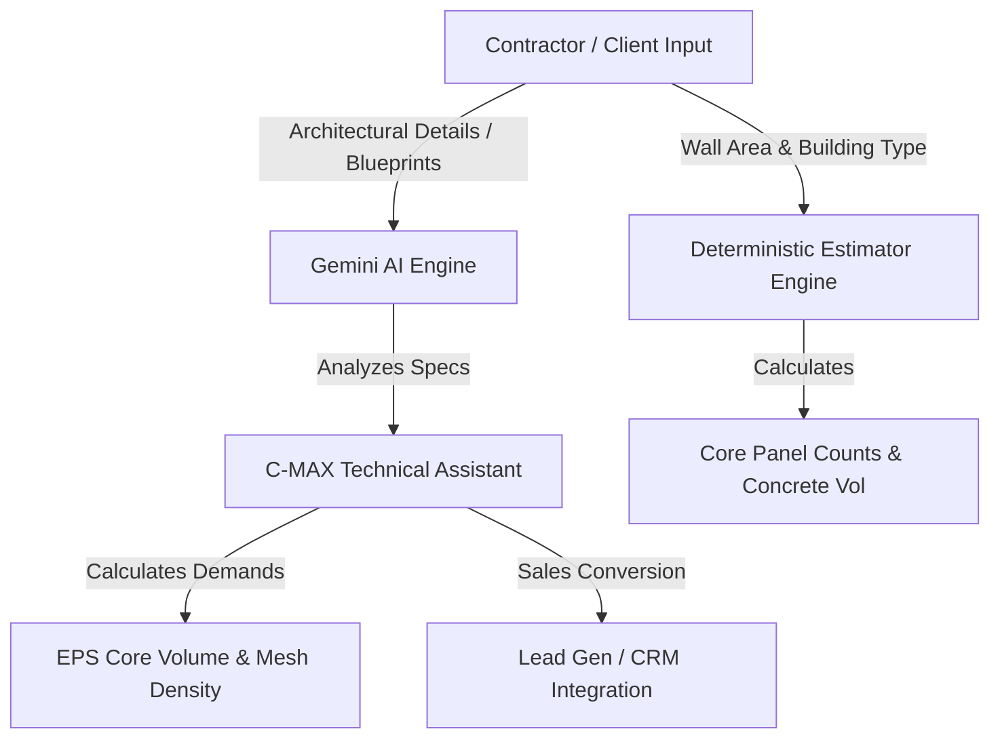

]\<div align="center">

</div>

# Panelique Building Systems — Authorized C-MAX® EPS Panels Digital Platform

An interactive commercial landing, technical estimation, and comparison portal for C-MAX® Expanded Polystyrene (EPS) Panels. This platform serves developers, contractors, and engineers looking to compare traditional masonry with C-MAX® structural panel systems, evaluate material quantities, and generate structural estimates.

## Platform Features

- **C-MAX® vs. Traditional Masonry Comparison**: Real-time analytical comparison of cost, construction speed, structural weight, thermal insulation, and fire resistance.
- **Dynamic Cost & Material Estimator**: Instantly calculate required EPS panel core counts and plastering/concrete volume based on wall measurements and building type.
- **AI-Powered Blueprint Assistant**: Built-in Gemini agent acting as a C-MAX® Technical Sales Advisor to answer structural queries and guide contractors in Kenya.
- **Digital Quote Center**: Smooth pipeline to convert estimation inquiries into hot sales leads.

---

## Technical Architecture & AI Engine

The platform integrates advanced generative AI to act as a technical sales co-pilot for contractors and engineers:



### 1. Structural Parameter Estimation
The system is designed to process structural parameters and input specifications to calculate:
- **EPS Core Volume**: Based on C-MAX® standard panels (each standard panel measures 3m²).
- **Concrete/Micro-Concrete Layering**: Computes the exact volume of structural plaster/shotcrete required. The standard specification requires a 35mm thick layer of concrete (strength class ≥ M25) applied on each side, totaling a 70mm (0.07m) outer structural concrete shell.
- **Steel Mesh Density**: Recommends the appropriate high-tensile double-galvanized steel mesh specification (standard wire diameters, pitch, and tensile strength) for single or double panel systems based on the building height, load requirements, and local regulations.

### 2. Gemini AI Integration (Technical Sales Advisor)
Using the Gemini API, the assistant is configured as a **C-MAX Technical Sales Advisor**. It uses structural reasoning to:
- Guide builders on panel selection (Single Panels for walls/partitions, Double Panels for load-bearing walls in high-rises, and Slab Panels for floors/roofs).
- Address engineering concerns (thermal conductivity $U$-values, fire ratings of up to 120+ minutes, and structural performance under seismic/wind loads).
- Capture structured customer inquiry details (such as names and phone numbers) to forward to the sales team as high-intent commercial leads.

---

## Local Development Setup

### Prerequisites

- **Node.js** (v18.0.0 or higher recommended)
- **Gemini API Key** (Obtained from Google AI Studio)

### Installation

1. Clone or download this repository.
2. Install the necessary project dependencies:
   ```bash
   npm install
   ```
3. Configure the environment variables. Duplicate the example configuration file:
   ```bash
   cp .env.example .env.local
   ```
   Open the newly created `.env.local` file and add your actual Gemini API key:
   ```env
   GEMINI_API_KEY="your-actual-api-key-here"
   ```
4. Run the development server:
   ```bash
   npm run dev
   ```
5. Open your browser and navigate to `http://localhost:3000`.
